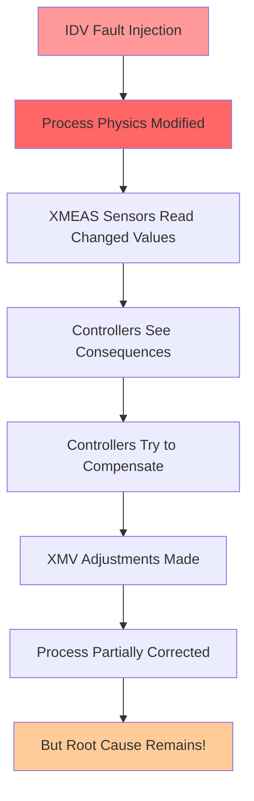

# IDV Fault Mechanisms - Complete Technical Analysis

## 🎯 **Executive Summary**

IDV (Independent Disturbance Variables) represent **equipment failures and process disturbances** that directly modify the physics of the Tennessee Eastman Process. Unlike XMV controls, IDV faults **bypass all controllers** and create persistent process upsets that controllers cannot eliminate.

**IDV faults simulate real industrial emergencies and equipment malfunctions.**

---

## 🔬 **IDV vs XMV: Fundamental Difference**

### **XMV (Manipulated Variables):**
- **Control Point**: Valve positions and setpoints
- **Controller Response**: Immediately overwritten by controllers
- **Effect**: Temporary (3 seconds) then corrected
- **Purpose**: Normal operational adjustments

### **IDV (Disturbance Variables):**
- **Control Point**: Process physics parameters
- **Controller Response**: Cannot be corrected - only consequences managed
- **Effect**: Persistent until IDV reset to 0
- **Purpose**: Simulate equipment failures and disturbances

---

## 🏭 **IDV Implementation in Process Physics**

### **Location in Fortran Code:**
All IDV effects are implemented in `teprob.f` within the process physics calculations, **before** any controller can see or respond to them.

### **Key Implementation Points:**
```fortran
! File: teprob.f, lines 407-416
XST(1,4)=TESUB8(1,TIME)-IDV(1)*0.03D0     ! A component composition
XST(2,4)=TESUB8(2,TIME)+IDV(2)*0.005D0    ! B component composition  
XST(3,4)=1.D0-XST(1,4)-XST(2,4)          ! C component (balance)
TST(1)=TESUB8(3,TIME)+IDV(3)*5.D0         ! A feed temperature
TST(4)=TESUB8(4,TIME)                     ! A&C feed temperature
TCWR=TESUB8(5,TIME)+IDV(4)*5.D0           ! Cooling water inlet temp
TCWS=TESUB8(6,TIME)+IDV(5)*5.D0           ! Cooling water supply temp
```

---

## 📊 **Complete IDV Fault Catalog**

### **Feed Disturbances (IDV 1-7):**

#### **IDV_1: A/C Feed Ratio, B Composition Constant**
```fortran
! Location: teprob.f line 407
XST(1,4) = TESUB8(1,TIME) - IDV(1)*0.03D0    ! Reduces A by 3%
XST(2,4) = TESUB8(2,TIME) + IDV(2)*0.005D0   ! B stays constant  
XST(3,4) = 1.D0 - XST(1,4) - XST(2,4)       ! C increases
```
**Physical Effect**: Changes feed composition ratios
**Why Controllers Can't Fix**: Composition is determined by upstream equipment
**Process Impact**: Reaction kinetics change, product quality affected
**D0 Meaning**: Double precision floating point constant (Fortran syntax)

#### **IDV_2: B Composition, A/C Ratio Constant**
```fortran
! Location: teprob.f line 409
XST(2,4) = TESUB8(2,TIME) + IDV(2)*0.005D0   ! Increases B by 0.5%
! A and C adjust to maintain ratio
```
**Physical Effect**: B component concentration increases
**Why Controllers Can't Fix**: Feed composition is externally determined
**Process Impact**: Changes reaction selectivity

#### **IDV_3: D Feed Temperature (Stream 2)**
```fortran
! Location: teprob.f line 411
TST(1) = TESUB8(3,TIME) + IDV(3)*5.D0        ! Increases temp by 5°C
```
**Physical Effect**: Feed enters reactor at higher temperature
**Why Controllers Can't Fix**: Feed temperature is upstream of control
**Process Impact**: Affects reaction rate and heat balance

#### **IDV_4: Reactor Cooling Water Inlet Temperature**
```fortran
! Location: teprob.f line 413
TCWR = TESUB8(5,TIME) + IDV(4)*5.D0          ! Increases by 5°C
```
**Physical Effect**: Cooling water less effective
**Why Controllers Can't Fix**: Utility system failure
**Process Impact**: Reactor temperature rises, potential runaway

#### **IDV_5: Condenser Cooling Water Inlet Temperature**
```fortran
! Location: teprob.f line 414
TCWS = TESUB8(6,TIME) + IDV(5)*5.D0          ! Increases by 5°C
```
**Physical Effect**: Condenser cooling reduced
**Why Controllers Can't Fix**: Utility system issue
**Process Impact**: Poor vapor condensation, pressure buildup

#### **IDV_6: A Feed Loss (Stream 1)**
```fortran
! Location: teprob.f line 567
FTM(3) = VPOS(3)*(1.D0-IDV(6))*VRNG(3)/100.0  ! Reduces flow
```
**Physical Effect**: A feed flow reduced or lost
**Why Controllers Can't Fix**: Physical equipment failure
**Process Impact**: Material balance upset, conversion drops

#### **IDV_7: C Header Pressure Loss - Reduced Availability**
```fortran
! Location: teprob.f line 569
FTM(4) = VPOS(4)*(1.D0-0.20*IDV(7))*VRNG(4)/100.0  ! 20% reduction
```
**Physical Effect**: C feed availability reduced
**Why Controllers Can't Fix**: Upstream pressure system failure
**Process Impact**: Feed ratio imbalance

---

### **Random Walk Disturbances (IDV 8-12):**

#### **IDV_8: A, B, C Feed Composition (Random Variation)**
```fortran
! Location: teprob.f lines 367-369 (via TESUB5/TESUB8)
! Creates random walk in feed composition
```
**Physical Effect**: Continuous composition drift
**Why Controllers Can't Fix**: Upstream process variability
**Process Impact**: Continuous process adjustment needed

#### **IDV_9: D Feed Temperature (Random Variation)**
**Physical Effect**: Temperature fluctuations
**Process Impact**: Heat balance disturbances

#### **IDV_10: C Feed Temperature (Random Variation)**
**Physical Effect**: Feed temperature drift
**Process Impact**: Thermal stability issues

#### **IDV_11: Reactor Cooling Water Inlet Temperature (Random)**
**Physical Effect**: Cooling effectiveness varies
**Process Impact**: Temperature control difficulties

#### **IDV_12: Condenser Cooling Water Inlet Temperature (Random)**
**Physical Effect**: Condensation efficiency varies
**Process Impact**: Pressure control problems

---

### **Slow Drift Disturbance (IDV 13):**

#### **IDV_13: Reaction Kinetics (Catalyst Deactivation)**
```fortran
! Location: teprob.f (affects reaction rates in TEFUNC)
! Slow degradation of catalyst activity
```
**Physical Effect**: Gradual loss of reaction efficiency
**Why Controllers Can't Fix**: Catalyst aging is irreversible
**Process Impact**: Conversion decreases over time, requires catalyst replacement

---

### **Valve Sticking Faults (IDV 14-20):**

#### **IDV_14: Reactor Cooling Water Valve Sticking**
**Physical Effect**: Cooling valve doesn't respond properly
**Why Controllers Can't Fix**: Mechanical failure of valve actuator
**Process Impact**: Poor temperature control

#### **IDV_15: Condenser Cooling Water Valve Sticking**
**Physical Effect**: Condenser valve mechanical failure
**Process Impact**: Condensation control problems

#### **IDV_16-20: Various Valve Sticking Faults**
**Physical Effect**: Mechanical failures of different control valves
**Why Controllers Can't Fix**: Hardware malfunctions
**Process Impact**: Loss of control authority

---

## 🔧 **Technical Details: Why IDV Bypasses Controllers**

### **Process Flow:**


### **Example: IDV_1 A/C Feed Ratio Fault**

**Step 1: Fault Injection (Physics Level)**
```fortran
XST(1,4) = 0.485 - 1.0*0.03 = 0.455    ! A drops from 48.5% to 45.5%
XST(3,4) = 1.0 - 0.455 - 0.005 = 0.540  ! C rises from 51% to 54%
```

**Step 2: Process Consequences**
- Reaction kinetics change due to different A/C ratio
- Product composition shifts
- Reactor temperature may change
- Conversion efficiency affected

**Step 3: Controller Response**
```fortran
! CONTRL13 (Component A Controller) tries to compensate:
ERR13 = SETPT(13) - XMEAS(23)    ! A composition error detected
DXMV = GAIN13 * ERR13            ! Calculate correction
SETPT(3) = SETPT(3) + DXMV       ! Adjust A feed setpoint
```

**Step 4: Limitation**
- Controller can adjust A feed rate (SETPT(3))
- But **cannot change the composition** of Stream 4
- Root cause (composition fault) persists
- Process operates in upset condition

---

## 🎯 **Why Fixed Values (0.03D0, 0.005D0)?**

### **Engineering Basis:**
1. **Realistic Magnitudes**: Based on actual industrial fault studies
2. **Process Stability**: Large enough to detect, small enough to avoid shutdown
3. **Research Consistency**: Standardized for academic benchmarking
4. **Safety Margins**: Won't cause catastrophic simulation failure

### **Typical Industrial Ranges:**
- **Composition Changes**: 1-5% (IDV uses 3% and 0.5%)
- **Temperature Changes**: 2-10°C (IDV uses 5°C)
- **Flow Reductions**: 10-50% (IDV uses 20-100%)

### **Research Standardization:**
- **Downs & Vogel (1993)**: Original TEP paper established these values
- **Academic Benchmarking**: Consistent fault magnitudes for comparison
- **Industrial Validation**: Values represent realistic fault scenarios
