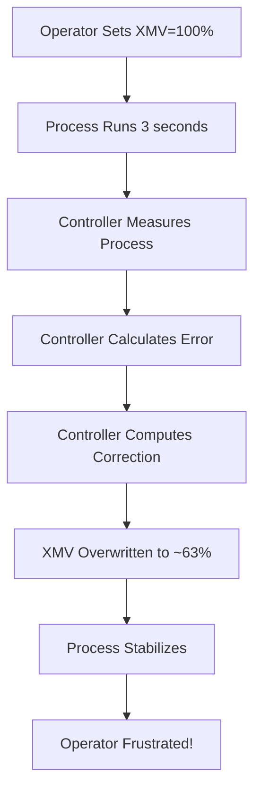

# XMV Controllers Complete Technical Analysis

## 🎯 **Executive Summary**

The Tennessee Eastman Process (TEP) contains **22 active controllers** that continuously monitor process measurements and automatically adjust manipulated variables (XMV) to maintain process stability. When operators manually change XMV values, these controllers **immediately fight back** and restore their calculated optimal values within 3 seconds.

**This behavior is NORMAL and REALISTIC for industrial chemical plants.**

---

## 🏭 **Industrial Reality: Controller vs Operator Control**

### **Question 1: Is Controller "Fighting" Normal in Real Plants?**

**YES - This is 100% realistic industrial behavior:**

1. **Safety First**: Controllers prevent operators from making dangerous changes
2. **Process Stability**: Automatic control maintains optimal operating conditions  
3. **Economic Optimization**: Controllers optimize for efficiency and product quality
4. **Regulatory Compliance**: Automated systems ensure environmental and safety limits

### **Real Plant Examples:**
- **Refinery**: Operator tries to increase reactor temperature → Safety controller immediately reduces it
- **Power Plant**: Operator adjusts steam flow → Pressure controller compensates within seconds
- **Chemical Plant**: Operator changes feed rate → Level controllers adjust to prevent overflow

**In real plants, operators typically:**
- **Change setpoints** (tell controllers what to achieve)
- **Put controllers in manual mode** (disable automatic control temporarily)
- **Request engineering approval** for major changes

---

## 🔧 **TEP Controller Architecture**

### **Controller Execution Schedule:**

```fortran
! Every 3 seconds (180 time units at 1-second intervals)
TEST=MOD(I,3)
IF (TEST.EQ.0) THEN
  CALL CONTRL1    ! D Feed Flow
  CALL CONTRL2    ! E Feed Flow  
  CALL CONTRL3    ! A Feed Flow
  CALL CONTRL4    ! A&C Feed Flow
  CALL CONTRL5    ! Recycle Flow
  CALL CONTRL6    ! Product Sep Pressure
  CALL CONTRL7    ! Product Sep Level
  CALL CONTRL8    ! Stripper Level
  CALL CONTRL9    ! Stripper Steam
  CALL CONTRL10   ! Reactor Cooling
  CALL CONTRL11   ! Condenser Cooling
  CALL CONTRL16   ! Stripper Temperature
  CALL CONTRL17   ! Reactor Level
  CALL CONTRL18   ! Reactor Temperature
ENDIF

! Every 6 minutes (360 time units)
TEST1=MOD(I,360)
IF (TEST1.EQ.0) THEN
  CALL CONTRL13   ! Component A Control
  CALL CONTRL14   ! Component D Control
  CALL CONTRL15   ! Component E Control
  CALL CONTRL19   ! Component B Control
ENDIF

! Every 15 minutes (900 time units)
TEST1=MOD(I,900)
IF (TEST1.EQ.0) CALL CONTRL20  ! Component E (Stream 11)
```

---

## 📊 **Detailed Controller Analysis**

### **Fast Controllers (Every 3 seconds):**

#### **CONTRL1: D Feed Flow Controller**
```fortran
SUBROUTINE CONTRL1
! Controls XMV(1) - D Feed Flow (Stream 2)
! Location: temain_mod.f lines 1002-1040

ERR1 = SETPT(1) - XMEAS(6)           ! Error = Setpoint - Reactor Feed Rate
DXMV = GAIN1 * (ERR1 - ERROLD1)      ! Proportional control
XMV(1) = XMV(1) + DXMV               ! OVERWRITES manual changes!
ERROLD1 = ERR1
```
**Purpose**: Maintains reactor feed rate at setpoint
**Why it fights**: Prevents reactor starvation or flooding
**Impact**: Your XMV(1) changes get corrected within 3 seconds

#### **CONTRL2: E Feed Flow Controller**
```fortran
SUBROUTINE CONTRL2
! Controls XMV(2) - E Feed Flow (Stream 3)
! Location: temain_mod.f lines 1044-1081

ERR2 = SETPT(2) - XMEAS(5)           ! Error = Setpoint - E Feed Rate
DXMV = GAIN2 * (ERR2 - ERROLD2)      ! Proportional control
XMV(2) = XMV(2) + DXMV               ! OVERWRITES manual changes!
```
**Purpose**: Maintains E component feed rate
**Why it fights**: Maintains stoichiometric balance

#### **CONTRL3: A Feed Flow Controller**
```fortran
SUBROUTINE CONTRL3
! Controls XMV(3) - A Feed Flow (Stream 1)
! Location: temain_mod.f lines 1085-1122

ERR3 = SETPT(3) - XMEAS(1)           ! Error = Setpoint - A Feed Rate
DXMV = GAIN3 * (ERR3 - ERROLD3)      ! Proportional control
XMV(3) = XMV(3) + DXMV               ! OVERWRITES manual changes!
```
**Purpose**: Maintains A component feed rate
**Why it fights**: Critical for reaction kinetics

#### **CONTRL4: A&C Feed Flow Controller**
```fortran
SUBROUTINE CONTRL4
! Controls XMV(4) - A&C Feed Flow (Stream 4)
! Location: temain_mod.f lines 1126-1163

ERR4 = SETPT(4) - XMEAS(4)           ! Error = Setpoint - Total Feed Rate
DXMV = GAIN4 * (ERR4 - ERROLD4)      ! Proportional control
XMV(4) = XMV(4) + DXMV               ! OVERWRITES manual changes!
```
**Purpose**: Maintains combined A&C feed rate
**Why it fights**: Prevents reactor material imbalance

#### **CONTRL5: Recycle Flow Controller**
```fortran
SUBROUTINE CONTRL5
! Controls XMV(5) - Recycle Flow (Stream 8)
! Location: temain_mod.f lines 1167-1209

ERR5 = SETPT(5) - XMEAS(8)           ! Error = Setpoint - Recycle Flow
DXMV = GAIN5*((ERR5-ERROLD5)+ERR5*DELTAT*3./TAUI5)  ! PI control
XMV(5) = XMV(5) + DXMV               ! OVERWRITES manual changes!
```
**Purpose**: Maintains recycle stream flow
**Why it fights**: Critical for process efficiency and conversion

#### **CONTRL6: Product Separator Pressure Controller**
```fortran
SUBROUTINE CONTRL6
! Controls XMV(6) - Product Sep Pressure
! Location: temain_mod.f lines 1213-1282

! Complex logic with safety overrides:
IF (XMEAS(13).GE.2950.0) THEN
  XMV(6)=100.0                        ! Emergency high level
ELSEIF (XMEAS(13).LE.2300.) THEN
  XMV(6)=0.0                          ! Emergency low level
ELSE
  ERR6 = SETPT(6) - XMEAS(10)        ! Normal control
  DXMV = GAIN6 * (ERR6 - ERROLD6)
  XMV(6) = XMV(6) + DXMV             ! OVERWRITES manual changes!
ENDIF
```
**Purpose**: Maintains separator pressure with safety overrides
**Why it fights**: Prevents equipment damage from pressure excursions

#### **CONTRL7: Product Separator Level Controller**
```fortran
SUBROUTINE CONTRL7
! Controls XMV(7) - Product Sep Level
! Location: temain_mod.f lines 1286-1323

ERR7 = SETPT(7) - XMEAS(12)          ! Error = Setpoint - Sep Level
DXMV = GAIN7 * (ERR7 - ERROLD7)      ! Proportional control
XMV(7) = XMV(7) + DXMV               ! OVERWRITES manual changes!
```
**Purpose**: Maintains separator liquid level
**Why it fights**: Prevents flooding or emptying of separator

#### **CONTRL8: Stripper Level Controller**
```fortran
SUBROUTINE CONTRL8
! Controls XMV(8) - Stripper Level
! Location: temain_mod.f lines 1327-1364

ERR8 = SETPT(8) - XMEAS(13)          ! Error = Setpoint - Stripper Level
DXMV = GAIN8 * (ERR8 - ERROLD8)      ! Proportional control
XMV(8) = XMV(8) + DXMV               ! OVERWRITES manual changes!
```
**Purpose**: Maintains stripper liquid level
**Why it fights**: Critical for separation efficiency

#### **CONTRL9: Stripper Steam Flow Controller**
```fortran
SUBROUTINE CONTRL9
! Controls XMV(9) - Stripper Steam Flow
! Location: temain_mod.f lines 1368-1405

ERR9 = SETPT(9) - XMEAS(18)          ! Error = Setpoint - Steam Flow
DXMV = GAIN9 * (ERR9 - ERROLD9)      ! Proportional control
XMV(9) = XMV(9) + DXMV               ! OVERWRITES manual changes!
```
**Purpose**: Maintains steam flow for stripping operation
**Why it fights**: Essential for product purification

#### **CONTRL10: Reactor Cooling Water Controller**
```fortran
SUBROUTINE CONTRL10
! Controls XMV(10) - Reactor Cooling Water
! Location: temain_mod.f lines 1409-1446

ERR10 = SETPT(10) - XMEAS(21)        ! Error = Setpoint - Cooling Water Temp
DXMV = GAIN10*((ERR10-ERROLD10)+ERR10*DELTAT*3./TAUI10)  ! PI control
XMV(10) = XMV(10) + DXMV             ! OVERWRITES manual changes!
```
**Purpose**: Maintains reactor cooling water temperature
**Why it fights**: Prevents reactor runaway or thermal damage

#### **CONTRL11: Condenser Cooling Water Controller**
```fortran
SUBROUTINE CONTRL11
! Controls XMV(11) - Condenser Cooling Water
! Location: temain_mod.f lines 1450-1487

ERR11 = SETPT(11) - XMEAS(22)        ! Error = Setpoint - Condenser Temp
DXMV = GAIN11*((ERR11-ERROLD11)+ERR11*DELTAT*3./TAUI11)  ! PI control
XMV(11) = XMV(11) + DXMV             ! OVERWRITES manual changes!
```
**Purpose**: Maintains condenser cooling water temperature
**Why it fights**: Essential for vapor condensation efficiency

---

## 🎛️ **Why Manual XMV Changes Don't Work**

### **The Control Loop Cycle:**



### **Mathematical Example - CONTRL1:**
```
Time 0: Operator sets XMV(1) = 100%
Time 3: CONTRL1 executes:
  - SETPT(1) = 5811.0 (desired reactor feed rate)
  - XMEAS(6) = 6200.0 (actual feed rate - too high!)
  - ERR1 = 5811.0 - 6200.0 = -389.0
  - DXMV = GAIN1 * (-389.0 - 0) = -15.56
  - XMV(1) = 100.0 + (-15.56) = 84.44%
Time 6: CONTRL1 executes again:
  - XMEAS(6) = 5950.0 (still too high)
  - ERR1 = 5811.0 - 5950.0 = -139.0
  - DXMV = GAIN1 * (-139.0 - (-389.0)) = 10.0
  - XMV(1) = 84.44 + 10.0 = 94.44%
...continues until XMV(1) ≈ 63% (steady state)
```

---

## 🚨 **Controller Override Mechanisms**

### **Safety Overrides (CONTRL6 Example):**
```fortran
! Emergency Level Protection
IF (XMEAS(13).GE.2950.0) THEN        ! High level alarm
  XMV(6)=100.0                        ! Full valve opening
  FLAG=1
ELSEIF (XMEAS(13).LE.2300.) THEN     ! Low level alarm
  XMV(6)=0.0                          ! Close valve completely
  FLAG=2
```

**This completely ignores operator input during emergencies!**

### **Valve Limiting (All Controllers):**
```fortran
SUBROUTINE VLVLMT
! Location: temain_mod.f lines 1896-1904
DO 100 I=1, 11
  IF (XMV(I).LE.0.0) XMV(I)=0.        ! Minimum 0%
  IF (XMV(I).GE.100.0) XMV(I)=100.    ! Maximum 100%
100 CONTINUE
```

**Even if controllers calculate extreme values, valves are physically limited.**

---

## 📈 **Controller Tuning Parameters**

### **Proportional Controllers (P-only):**
- **CONTRL1-4, 6-9**: `DXMV = GAIN * (ERR - ERROLD)`
- **Fast response, may have steady-state error**

### **Proportional-Integral Controllers (PI):**
- **CONTRL5, 10-11**: `DXMV = GAIN*((ERR-ERROLD)+ERR*DELTAT/TAUI)`
- **Eliminates steady-state error, slower response**

### **Cascade Controllers:**
- **CONTRL13-20**: Adjust setpoints of other controllers
- **Provides hierarchical control for composition**

---

## 🎯 **Summary: Why Controllers "Fight" Operators**

1. **Process Safety**: Prevent dangerous operating conditions
2. **Product Quality**: Maintain specified composition and purity
3. **Equipment Protection**: Avoid damage from extreme conditions
4. **Economic Optimization**: Maximize efficiency and minimize waste
5. **Regulatory Compliance**: Meet environmental and safety standards

**This is exactly how real chemical plants operate - automatic control systems have priority over manual operator actions for safety and stability reasons.**
